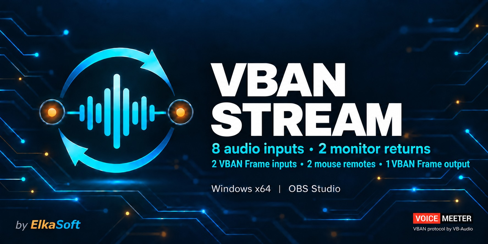
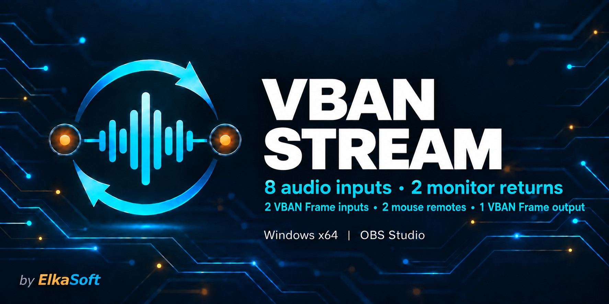
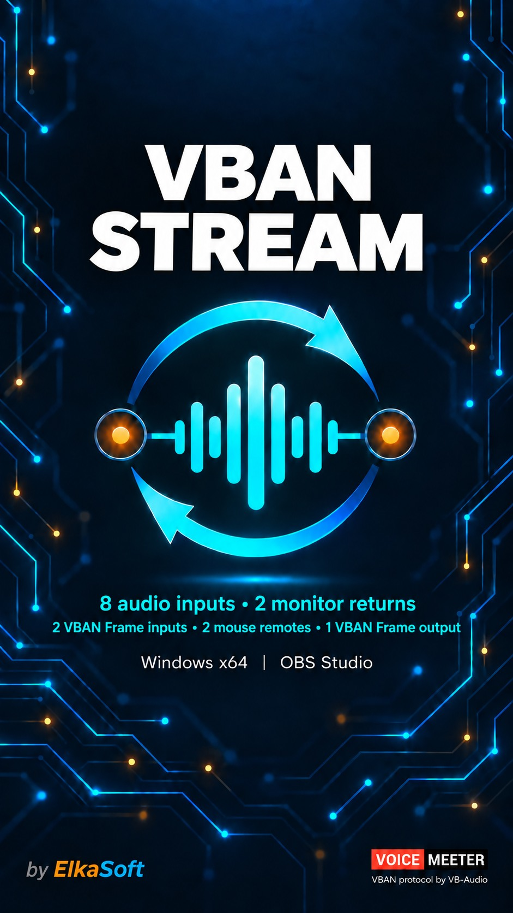
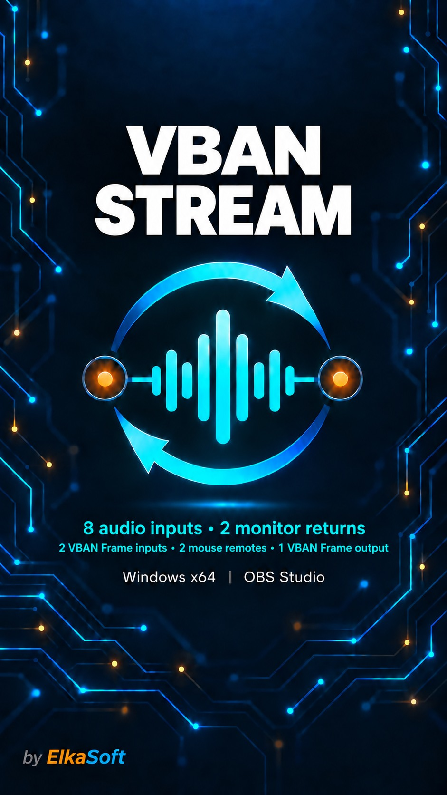
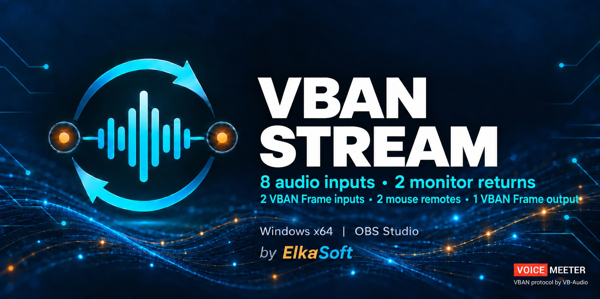
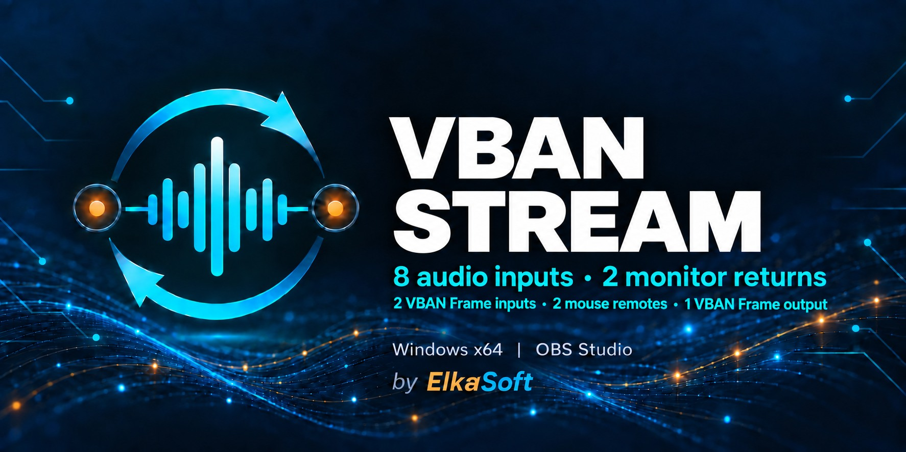
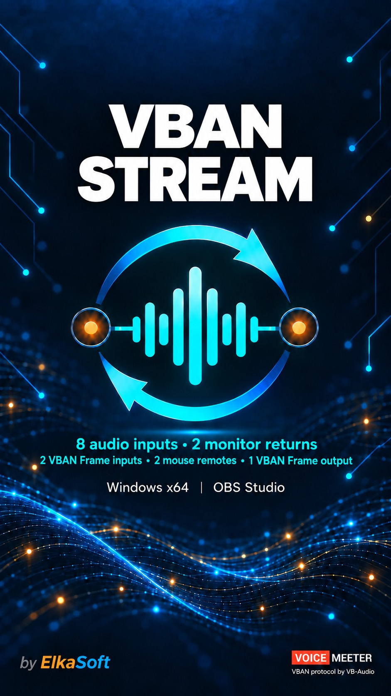
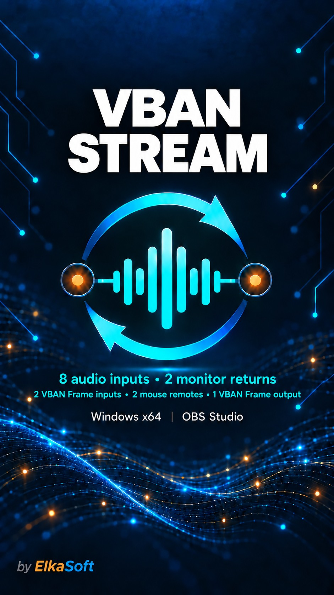

# VBAN Stream artwork

Eight banners for **VBAN Stream by ElkaSoft**, with the audio, video and mouse-control features from the **0.3.5 development release**. Choose straight circuit lines or waves with circuit lines, horizontal or vertical, with or without the VoiceMeeter / VB-Audio corner credit.

The feature text is arranged in two rows:

> 8 audio inputs • 2 monitor returns 
> 2 VBAN Frame inputs • 2 mouse remotes • 1 VBAN Frame output

The audio inputs accept one to eight channels per stream. Each video input has its own mouse-control route. The video output sends the OBS Program picture.

## Download the current set

[Download all eight PNGs and eight JPEGs](https://github.com/torment78/vban-stream/releases/download/v0.3.5/VBAN-Stream-artwork-0.3.5.zip).

Every JPEG is **under 1,000,000 bytes**, exported at quality 92 with no resizing. Horizontal banners remain **1774 × 887**; vertical banners remain **941 × 1672**.

| Design and version | Dimensions | Web / social image | PNG master |
| --- | --- | --- | --- |
| Circuits — horizontal — with credit | 1774 × 887 | [JPEG (229.1 KB)](images/wide-tagged-0.3.5.jpg) | [PNG](images/wide-tagged-0.3.5.png) |
| Circuits — horizontal — without credit | 1774 × 887 | [JPEG (225.4 KB)](images/wide-untagged-0.3.5.jpg) | [PNG](images/wide-untagged-0.3.5.png) |
| Circuits — vertical — with credit | 941 × 1672 | [JPEG (237.2 KB)](images/vertical-tagged-0.3.5.jpg) | [PNG](images/vertical-tagged-0.3.5.png) |
| Circuits — vertical — without credit | 941 × 1672 | [JPEG (229.9 KB)](images/vertical-untagged-0.3.5.jpg) | [PNG](images/vertical-untagged-0.3.5.png) |
| Waves — horizontal — with credit | 1774 × 887 | [JPEG (264.9 KB)](images/waves-wide-tagged-0.3.5.jpg) | [PNG](images/waves-wide-tagged-0.3.5.png) |
| Waves — horizontal — without credit | 1774 × 887 | [JPEG (260.5 KB)](images/waves-wide-untagged-0.3.5.jpg) | [PNG](images/waves-wide-untagged-0.3.5.png) |
| Waves — vertical — with credit | 941 × 1672 | [JPEG (272.3 KB)](images/waves-vertical-tagged-0.3.5.jpg) | [PNG](images/waves-vertical-tagged-0.3.5.png) |
| Waves — vertical — without credit | 941 × 1672 | [JPEG (264.2 KB)](images/waves-vertical-untagged-0.3.5.jpg) | [PNG](images/waves-vertical-untagged-0.3.5.png) |

## Straight circuit lines

| Horizontal with credit | Horizontal without credit |
| --- | --- |
|  |  |

| Vertical with credit | Vertical without credit |
| --- | --- |
|  |  |

## Waves with circuit lines

| Horizontal with credit | Horizontal without credit |
| --- | --- |
|  |  |

| Vertical with credit | Vertical without credit |
| --- | --- |
|  |  |

## Choosing a banner

The README uses `docs/images/wide-tagged-0.3.5.jpg`. To switch to the wave design, use `docs/images/waves-wide-tagged-0.3.5.jpg`. Choose an `untagged` file to omit the VoiceMeeter badge and protocol caption; every version keeps **by ElkaSoft**.

For a website, use a horizontal banner on a wide layout or a vertical banner on a portrait layout. Keep its natural aspect ratio with `height: auto` so the text and credits remain visible.

For GitHub social preview, upload a horizontal JPEG under **Settings → Social preview → Edit → Upload an image**. All four horizontal JPEGs are below one megabyte.

These feature edits retain the original **Windows x64 | OBS Studio** artwork line. The 0.3.5 development release also offers a universal Mac test installer; see the [current downloads](../README.md#download-and-install).

## Earlier artwork

The original artwork remains beside the new files in `docs/images`; the new set adds `-0.3.5` to each filename. The older banners use the single audio-feature row.

[Download the earlier PNG + JPEG ZIP](https://github.com/torment78/vban-stream/releases/download/v0.2.5/VBAN-Stream-artwork.zip).

| Design and version | Dimensions | Web / social image | Original image |
| --- | --- | --- | --- |
| Circuits — horizontal — with credit | 1774 × 887 | [JPEG (214.5 KB)](images/social-preview.jpg) | [PNG](images/wide-tagged.png) |
| Circuits — horizontal — without credit | 1774 × 887 | [JPEG (209.2 KB)](images/social-preview-untagged.jpg) | [PNG](images/wide-untagged.png) |
| Circuits — vertical — with credit | 941 × 1672 | [JPEG (226.9 KB)](images/vertical-tagged.jpg) | [PNG](images/vertical-tagged.png) |
| Circuits — vertical — without credit | 941 × 1672 | [JPEG (219.2 KB)](images/vertical-untagged.jpg) | [PNG](images/vertical-untagged.png) |
| Waves — horizontal — with credit | 1774 × 887 | [JPEG (248.9 KB)](images/waves-wide-tagged.jpg) | [PNG](images/waves-wide-tagged.png) |
| Waves — horizontal — without credit | 1774 × 887 | [JPEG (243.0 KB)](images/waves-wide-untagged.jpg) | [PNG](images/waves-wide-untagged.png) |
| Waves — vertical — with credit | 941 × 1672 | [JPEG (258.3 KB)](images/waves-vertical-tagged.jpg) | [PNG](images/waves-vertical-tagged.png) |
| Waves — vertical — without credit | 941 × 1672 | [JPEG (251.8 KB)](images/waves-vertical-untagged.jpg) | [PNG](images/waves-vertical-untagged.png) |

## Creation

The eight existing PNGs were edited individually with the built-in imagegen tool, changing the feature copy to two rows while retaining the established backgrounds, logo, title and credits. The JPEGs are full-resolution compressed exports of those edited PNGs. Application and installer icons are separate and unchanged.

See the [complete edit prompts](ARTWORK-PROMPTS.md#035-feature-update) and [icon documentation](ICON.md).
